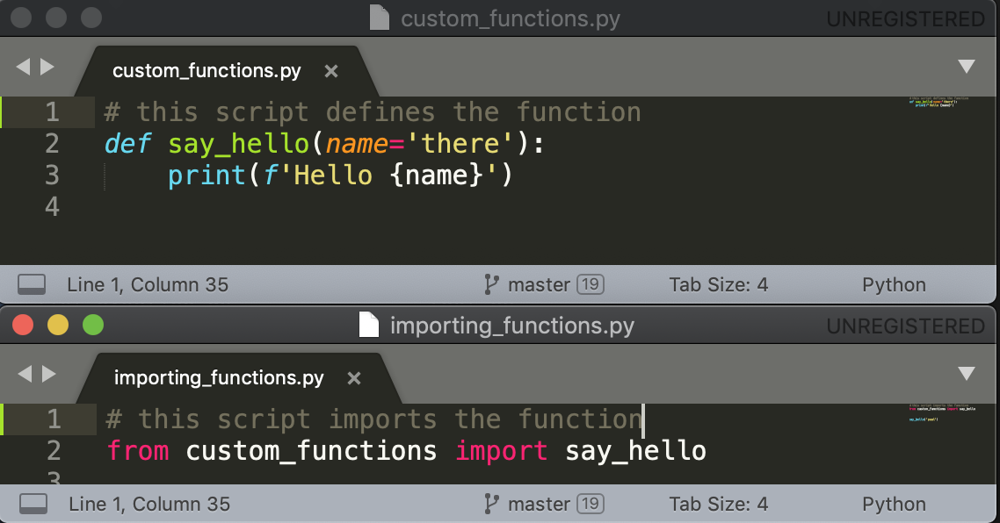
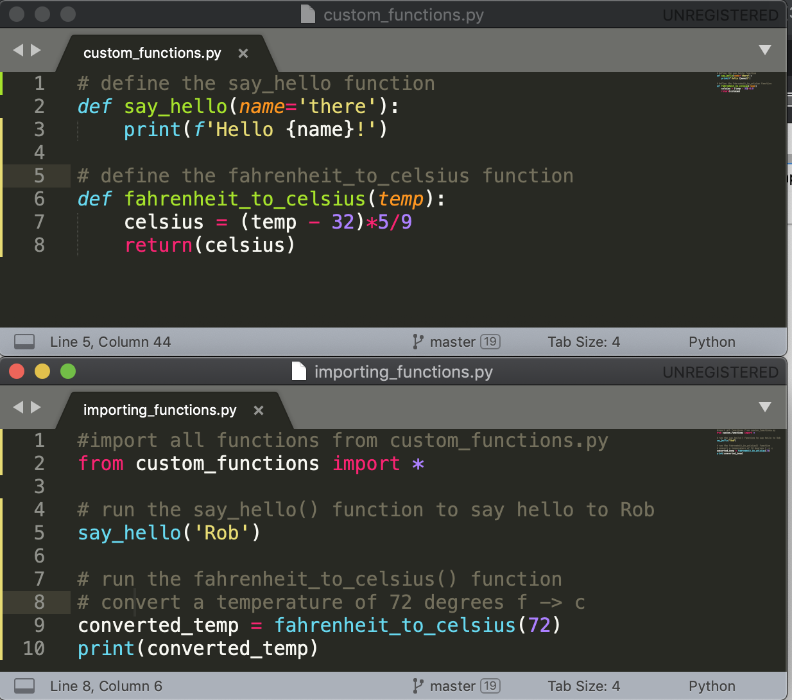
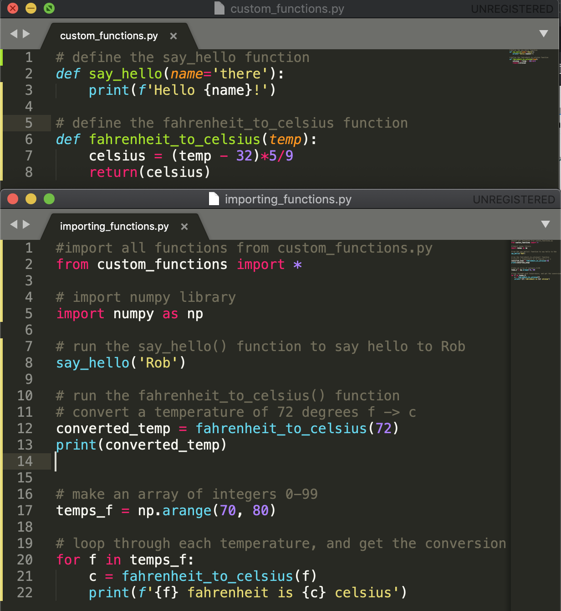

# Bootcamp class 13 - Importing Libraries & Functions


# Before class

* Make sure you feel comfortable **defining** and **calling** [functions](https://github.com/Justice-Through-Code/fall_2020/blob/master/lessons/13_bootcamp_functions/13_bootcamp_functions.md)
* Make sure you feel comfortable working with [nested data types](https://github.com/Justice-Through-Code/fall_2020/blob/master/lessons/11_bootcamp_nested_data/11_bootcamp_nested_data.md)
* Make sure you feel comfortable pushing your files to [Github](https://github.com/Justice-Through-Code/fall_2020/blob/master/lessons/02_git/git_lesson.md)

# Outline of class agenda

Today we'll learn about **importing libraries** and **importing functions** in python. By the end of the lesson, you'll:

1. Feel comfortable importing existing libraries (like `numpy` and `os`)
2. Feel comfortable using functions from imported libraries
3. Feel comfortable importing **your own functions** in python scripts
4. Feel comfortable calling functions that you've created and imported

# Review: what is a function?

A **function** is a block of code that only runs when it's called. Using functions we can:
* Reduce the need for copying and pasting block of code that is frequently written in a program
* Thinking of a program as series of procedures or steps where function names are the names for those procedures

# What is 'importing'?
* [Importing](https://docs.python.org/3/reference/import.html) means that within a python script, we are bringing in some code/functions **beyond** the [standard python library](https://docs.python.org/3/library/). These can be extra functions that help with a variety of things.
* Importing lets us keep our scripts short and broken into reasonable chunks -- we don't have to write our code in one long script, and we can easily pull in work that has already been done elsewhere 


Let's make a script `bootcamp_scripts/importing_practice.py` for the lesson today

# 1. Importing existing python libraries

## What is a python library?

* A 'library' is a set of python functions, bundled together
* All the functions we've been using so far come from the [python standard library](https://docs.python.org/3/library/)
* It is possible to `import` additional libraries to get more functions
* When we import libraries, we are pulling in more functions we can use in our python code
* Curious about what libraries there are? Here is a [list of some commonly used ones](https://www.ubuntupit.com/best-python-libraries-and-packages-for-beginners/)

## Importing an entire library

To import an existing library and use its functions in our code, we use the `import` command. 
* Usually we do this at the top of the script
* If you see **no output**, importing has worked! 
* If importing fails, you'll get output telling you so
  * Probably the most common reason for failed importing is if you don't already have the library installed. We'll talk about installing libraries next class!
  

### Example: importing the `os` library

As one example, let's import the library [os](https://docs.python.org/3/library/os.html), which will allow us to run command line functions (such `ls`, and `cd`) etc from within python. 

```python
import os
```

That's it! We've imported the `os` library and now we can use the functions it has. We'll explore this soon!


### Example: importing the `numpy` library with the `np` alias

Let's now import the library [numpy](https://numpy.org/). numpy is a library with lots of extra functions for dealing with numerical data, and we use it a lot for code doing mathematical operations

To import the whole library, we can run:

```python
import numpy as np
```

That's it! You might we wondering that the `as np` part means.
* The `as np` means that we have [created an alias](https://www.w3schools.com/python/ref_keyword_as.asp) to reference the `numpy` library. 
* Now, we can call numpy by the alias (kind of like a nickname) `np` when we want to use it. We'll see that soon


### Example: importing a specific function from the `numpy` library

Let's say we don't actually need all the functions in the numpy library, but just one function, called `arange()`

In this case, we can run:

```python
from numpy import arange
```

Instead of getting all the numpy functions, this will specifically import `arange()` so we can use just this one. 
* Why would we want to do this? Some libraries have a lot of functions, so we might be able to save time and memory this way


# 2. Using functions from imported libraries

Now that we've imported some libraries, let's use their functions! 
* **Importantly**, we have to **import libraries before using them**, unless they are part of the python standard library
* In general, when we importa a library, we specify that we are using the functions from that library with the syntax `library.function()`

### Example: using `os.system()`

Here, we use the `system()` function from the os library to run the `ls -l` command and get a printout about our files in the working directory

```python
# import os
import os

# use ths `system()` function from os
os.system('ls -l')
```

So, here `os` is the library and `system()` is the function. The `.` specifies that the `system()` function we want to use is **part of the `os` library**

When we run this, it is as if we ran `ls -l` from the unix command line:

```console
total 72
-rw-r--r--@ 1 paul  staff  2307 Oct 13 19:39 functions_practice.py
-rw-r--r--  1 paul  staff  1408 Sep 29 19:34 list_practice.py
-rw-r--r--@ 1 paul  staff  2161 Oct  8 19:32 nested_data_practice.py
-rw-r--r--@ 1 paul  staff  1724 Oct  6 19:39 nested_loop_practice.py
-rw-r--r--  1 paul  staff   347 Oct 14 14:18 importing_practice.py
-rw-r--r--@ 1 paul  staff   453 Oct  6 18:49 regular_loop_practice.py
```

### Example using `numpy` functions 

Let's use `numpy` as `np` to do a little math! Let's do 2 things here
1. Get the average (or 'mean') of a list of numbers using `np.mean()`
2. Generate a [numpy array](https://numpy.org/doc/stable/reference/generated/numpy.array.html) (similar to a list) of integers


```python
num_list = [5,7,9,12,200]

# use np.mean() to take the average of the list
list_average = np.mean(num_list)

# use np.arange() to generate an aray of 50 numbers, starting with 0 and going up by 1
more_nums = np.arange(50)

print(f'list average is {list_average}')
print(f'some more numbers: {more_nums}')
```

So when we run this code, we get:

```console
list average is 46.6
some more numbers: [ 0  1  2  3  4  5  6  7  8  9 10 11 12 13 14 15 16 17 18 19 20 21 22 23
 24 25 26 27 28 29 30 31 32 33 34 35 36 37 38 39 40 41 42 43 44 45 46 47
 48 49]
```

In both these cases, we've used the `np.function()` syntax to use a function from the `numpy` library. 

# 3. Importing your own functions

In addition to importing functions from existing python libraries, we can **import our own functions from other python scripts**. This is especially useful, since it means we can write our functions in one set of scripts, then save them in another. 

So, to get started with this, let's make another script called `bootcamp_scripts/custom_functions.py`
* We're going to write some functions here, then import them to our script
* For this to work, make sure `custom_functions.py` and `importing_functions.py` are **in the same directory!**


### First: define a function in `custom_functions.py`

We'll define a function we used, before, the `say_hello` one:

```python
def say_hello(name='there'):
    print(f'Hello {name}!')
```

### Then, import your function!

To import this function specifically, we can include in our `importing_functions.py` script the following:

```python
from custom_functions import say_hello
```

This script will now import the `say_hello()` function so it can be used! Notice, we don't include the `.py` at the end of the file name, or any parenthesis in referencing the function. 

To clarify, this is how your two scripts should look like, one for defining the function, and the other importing it:



### Importing multiple functions from a script using `*` as a wildcard

Let's say we had a few functions in the `custom_functions.py` script. Let's define one more that converts fahrenheit to celsius:

```python
def fahrenheit_to_celsius(temp):
    celsius = (temp - 32)*5/9
    return(celsius)
```

Then, to import **everything** in `custom_functions.py`, we use the `*` notation as a [wild card](https://www.educative.io/edpresso/how-to-implement-wildcards-in-python).


```python
from custom_functions import *
```

What the `*` does here is tell python to import **every** function in `custom_functions.py`. Now we can use any function included in this script

# 4. Calling functions you have imported

Alright! Now we've imported some functions we defined into `importing_functions.py`. Now, let's call them (run them)!
* Importantly, in this context, we run the functions in the **script where we've imported them**, not where we have defined them


So in `importing_functinos.py`, we put:

```python
# run the say_hello() function to say hello to Rob
say_hello('Rob')

# convert a temperature of 72 degrees fahrenheit to celsius
converted_temp = fahrenheit_to_celsius(72)
print(converted_temp)
```

So, here's our setup:



Crucially, in `importing_functions.py`, we **import all the functions from `custom_functions.py` before calling them**

When we run `importing_functions.py`, we get the following output, showing both functions worked:

```console
Hello Rob!
22.22222222222222
```

### Example: combining `numpy` and our own `fahrenheit_to_celsius()` function

Now, we'll use `np.arrange()` to make an array of fahrenheit temperatures, then convert them all to celsius with our own function. Remember, for this to work, we'll have to **first** make sure our script is importing numpy as `np`. So, we'll add

```python
# make an array of integers between 70 and 80
temps_f = np.arange(70, 80)

# loop through each temperature, and get the conversion to celsius
for f in temps_f:
    c = fahrenheit_to_celsius(f)
    print(f'{f} fahrenheit is {c} celsius')
```

Overall, our two scripts now look like:



When we run `importing_functions.py`, we use both our own function and `numpy` now! The output looks like:

```console
Hello Rob!
22.22222222222222
70 fahrenheit is 21.11111111111111 celsius
71 fahrenheit is 21.666666666666668 celsius
72 fahrenheit is 22.22222222222222 celsius
73 fahrenheit is 22.77777777777778 celsius
74 fahrenheit is 23.333333333333332 celsius
75 fahrenheit is 23.88888888888889 celsius
76 fahrenheit is 24.444444444444443 celsius
77 fahrenheit is 25.0 celsius
78 fahrenheit is 25.555555555555557 celsius
79 fahrenheit is 26.11111111111111 celsius
```

# Overview of what we learned today


We learned some really powerful tools today!

* How to import additional libraries in python, like `numpy`
* How to import specific funtions from libraries
* How to separately `define`, `import`, and `call` functions separated across 2 different files

This kind of coding helps us make our code more [**modular**](https://en.wikipedia.org/wiki/Modular_programming). This means that we can separate our code into different pieces that are more interchangeable and independent, and use them together to build software to achieve our goals.

Feeling limited with the libraries we've learned so far? Don't worry, because we'll be learning how to *install additional python libraries* soon...


```python

```
