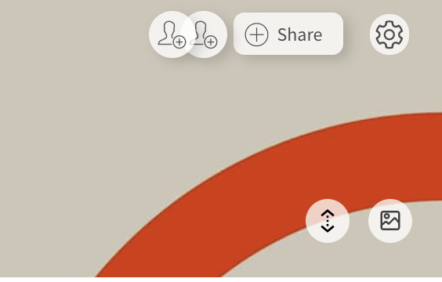
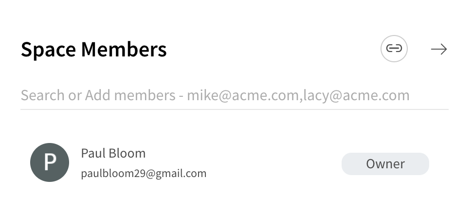
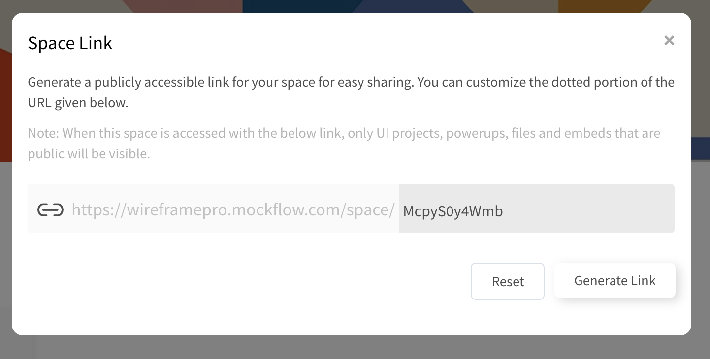
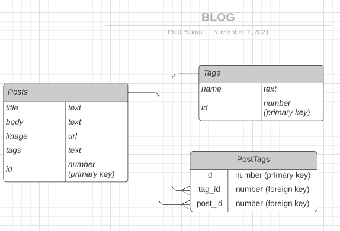

# Project 3: WOW Django App

Welcome to your final project of the course! This one is called the "WOW project"

You'll work in groups of 3 (you choose the groups) to create a custom Django app. The end product of this project is much more open-ended than the previous ones. There are requirements that you'll have to meet, but beyond that *you get to decide what to build!* 

This is a great chance both to show your coding skills *and* your creativity, so we hope that you enjoy!

## Overview

Like the Blog App and To-do List App from the class challenges, your WOW project should have CRUD functionality (the app can create, read, update, and delete data dynamically based on user interactions). 
* This time, however, what your app does is up to you! For example:
    * Review site for books, movies or consumer goods
    * Recipe site for specific cuisine
    * Curator of specific services in your area (social services, hair salons, coffee shops, etc)
    * Online community board for jobs and volunteering
* You'll want to think carefully about what functionality you want to give your app ahead of time, and the JTC team will help you workshop your ideas to come up with your project. 

## The Minimum Viable Product (MVP)

### *What is an MVP?* 

A **minimum viable product** is a version of your project with only the minimum features to be useable as a first version. 
* It is the simplest solution to your problem possible (*minimum*)
* It should perform the essential functions (*viable*)
* It should be something that is useful that users can actually work with (*product*)

Your first challenge for the final WOW project is identifying the MVP for your Django app. This will help guide your work on the project at all stages, and you'll primarly be evaluated on how your final project does at achieving your MVP. 

# Proposal Part 1: Wireframes + short written proposal (Due Thursday, November 18)

**Note:** Most of the actual wireframe building will happen in class, where you'll do a workshop on wireframes then have guided time in your groups to build them. 

For the first part of your project, you'll build a **wireframe** of your MVP, which is a visual guide representing what your site will look like, and what features it will have. See more info on wireframes [here](https://balsamiq.com/learn/articles/what-are-wireframes/).

### Getting set up for wireframews with MockFlow (You'll do most of this in class following a dedicated workshop)

* You'll use a site called MockFlow to build wireframes. This site will let you basically "sketch" what your app will look like to users. 

* Each group member should make a [MockFlow](https://mockflow.com/) account, but you'll only need one project (you'll work on this in class to do most of this together over Zoom). All group members should collaborate on the same project, so first one member will set up a project, then add collaborators by clicking "share" in the upper right-hand corner:

* Then add group members' email addresses to collab (note: collaborators will only be able to be "reviewers", not "editors" with the free version. So, the actual construction of the wireframe should happen *when all group members are present*):

### To build your wireframe:

* It is very open-ended how you create your wireframe using MockFlow, but it should accomplish the following:
    1. Demonstrate visually what your app will look like for users with a mock-up of each page you will build. 
    2. You'll need to have mock-ups of at *least 2 page templates* in your wireframe
    3. Your wireframe should have clear information on what any buttons, forms, or hyperlinks do. It should be clear how users can interact with the app!
* Remember that although this is extremely open-ended, **you want to tailor your wireframe to represent your eventual Minimum Viable Product (MVP)**
    * Since you'll have to build everything represented in your wireframe using Django, make sure your are thinking ahead to make sure your proposed plan is feasible! 
    * As JTC instructors and TAs, we will help figure out if you will need to scale back to a smaller set of pages or features. *You will get feedback on your wireframe MVP well before you have to start implementing it with Django*

## How to submit:

### Wireframe

* Export a PDF file from MockFlow containing all of your wireframe pages, then upload this PDF to Canvas.
* Also, please upload the PDF to your group's Google Drive folder, so your TAs and mentors can see it and help with it. 

### 1-page written proposal

In addition to the wireframe, your group should submit a written proposal that is 1 page of text or less to Canvas. This proposal should contain the following:

* **Paragraph 1:** A summary of your app's MVP functionality. Be specific here, because we will evaluate your final project on completion of this functionality (once you have a chance to incorporate JTC staff feedack)
* **Paragraph(s) 2-3:** A description of the pages (routes) you're proposing in the wireframe, and how they link together. 
* **Paragraph(s) 3-4:** How you propose to break up the project into separate tasks among group members, and any challenges you anticipate in putting the project together with Django. 

### Example wireframe for Youtube

### Another example wireframe for a website

# Proposal Part 2: Models (Due Monday, November 29)

The next stage of your project after you have defined your MVP and made your wireframe is to diagram out how your database will work. To do this, your group will make an [Entity-Relationship Diagram (ER Diagram)](https://www.lucidchart.com/pages/er-diagrams) using LucidChart. 

**Note:** Most of the actual ER Diagram building will happen in class, where you'll do a workshop on them, and then have guided time in your groups to build them. 

## Requirements 
* The point of the ER Diagram is to map visually what your MVP database will look like. **Your ER Diagram should map directly to your MVP** to outline the models you will create in Django using `models.py` to construct your database
* Your ER Diagram **must** outline at least **1 one-to-many** and **1 many-to-many** entity relationship. You may have more if you want.  

### Example ER Diagram from the Blog App Project

Your ER Diagram should look similar in design to something like this:

**Note:** Django handles the many-to-many relationship shown below using [models.ManyToManyField](https://docs.djangoproject.com/en/3.2/topics/db/examples/many_to_many/) under the hood. You should draw out how you'll implement at least 1 many-to-many relationship like this in your ER diagram, but you'll be able to use `models.ManyToManyField` once you actually code this in Django (i.e. you won't need to make a distinct `PostTags` model in `models.py`). 

## Making your Entity-Relationship Diagram (you'll do this mostly in class following the workshop)

All group members should:
* Sign up for a free account at [Diagrams.net](https://www.diagrams.net/)
* Make a "new diagram", and choose the "Entity-Relationship Diagram" template from the options below for a nice template for getting started

## Submit your Entity-Relationship Diagram

* Export your ER Diagram as a PDF, then upload the PDF to Canvas when you're done! 
* Also, please upload the PDF to your group's Google Drive folder, so your TAs and mentors can see it and help with it. 

# WOW Final: Minimum Viable Product (Due Thursday, December 16)

Just like the previous projects, the final submission for this project will be a link to a public Github repository. No files will need to be uploaded to Canvas. 

## Create your group repository

The following can be completed by one member of your group to create a Github repo that your group will use for the project. 

1. Create a new repository for the group on Github

2. Invite your group member to the repository to start collaborating on the project!

3. This time, you'll be making the Django project from scratch. So, one group member should initially set up a new Django project in your repo. 

4. Then, all group members can clone the repo to their own computers. You can work together to start building the app from there. 

## MVP Requirements

### Technical

- All members must be contributing & commiting Python code
- Development of the project should make use of issues & separate branches in git for new features or edits, pull requests, and review of your collaborators' code. When evaluating your project, JTC instructors & TAs will check the pull request history to look for use of issues, branches, and code review. 
- App has CRUD features (Create, Read, Update, Delete)
- Minimum one URL with dynamic route path
- Minimum **one one-to-many** and **one many-to-many relationship** (you can have more) in Django models
    - Models must be registered in admin view
- Minimum **one Django form**
- Must employ use of 2 types of template syntax like `url`, `for loops`, `if/else`, and filters
- Must complete all items proposed in MVP proposal

### Constraints:
- No Public APIs
- No frontend Javascript library/frameworks (jQuery, React).
- CSS library frameworks are fine (Bootstrap), however we are not evaluating on your aesthetic chops!

### WOW Submission

-   The link to the group repository will be submitted by one of the group members in [Courseworks](https://courseworks2.columbia.edu/courses/141443/assignments/738771)
-   The group repository must include a `README.md` markdown file. To format your markdown file beautifully, check out this [guide](https://www.markdownguide.org/basic-syntax) on markdown syntax
-   The `README.md` must contain the following information
    -   Name of project
    -   Names of group members and their Github usernames
    -   Instruction on how to create and run a virtual environment using `venv`
    -   Instruction on how to install project dependencies with `pip`
    -   Screenshots of your app,  and instruction on how to run the Django application
-   The commit history in Github should show equal contributions from all group members
- Your working app should be on the `main` branch of the repository
- You are not required to deploy your application. JTC will provide resources for learning how to do this following the end of the class, but it is not part of the WOW project and should not be part of your MVP. 

## Rubric For Final WOW Evaluation (40 points total)

Category | Requirement | Points      |   Description  | 
| -----------  | ----------- | ----------- | ----------- |
Github | Github repo is public &  submitted to canvas | 2 | Make sure the JTC team can easily access your submission!
Documentation | Github repo includes `README.md` on main branch | 3 | README uses [Markdown formatting](https://www.markdownguide.org/cheat-sheet/) for clear organization. README has name of project, names of group members, instructions on how to make/run a virtual environment with `venv` and install all code dependencies with `pip` & *screenshots from the app with instructions on how to run*. 
Documentation | Code is well-commented | 2 | Python code should have comments with relevant explanation of views, models, routes, and forms. Comments should demonstrate understanding of the code and make functionality clear to anyone new to the project.
Collaboration | All group members are using issues, committing, & reviewing python code | 3 | Github repo commit & pull request history shows that all group members are creating issues, contributing to code, making new features & edits on branches, and using pull requests to review code before merging to `main`.
Collaboration | Positive communication between group members & with mentors | 2| Group members should work effectively to balance work & resolve any differences in opinions. Mentors **should not** be asked to resolve any disagreements that come up. 
MVP | Submission accomplishes MVP as proposed | 5 | Submission implements the project proposal (as approved by JTC staff) described by the wireframe and ER Diagram. 
Django | App runs cleanly | 2 | App runs without errors when tested for functionality specified by in the MVP. App should run cleanly based on the code on the `main` branch following instructions outlined in the `README.md` file. 
Django | App has CRUD functionality | 5 | App can create, read, update, and delete data based on user interactions. 
Django | Routes | 3 | Minimum one URL with dynamic route path
Django | Models | 5 | Minimum **one one-to-many** and **one many-to-many relationship** (you can have more) in Django models, and models must be registered in admin view
Django | Form | 3 | At least 1 Django form, where the database is updated via a POST request when the form is submitted
Django | Template Syntax | 3 |  Employ use of at least 2 types of template syntax like `url`, `for loops`, `if/else`, and filters
Other | No use of Public APIs or additional frontend Javascript libraries/frameworks | 2 | These tools are beyond the scope of the course, so please do not use them for the WOW submission. *After you turn in your WOW for completion of JTC, feel free to add any other tools you wish!*

## Helpful Topics to Review
- Python data structures like Lists, Dictionaries and their methods
- Python Classes and Inheritance
- Django [URLs](https://docs.djangoproject.com/en/3.2/topics/http/urls/) to understand how to capture parameters in your views 
- Django [Templates](https://docs.djangoproject.com/en/3.2/ref/templates/language/)
- [Relational Databases]()
- Django [Models](https://github.com/Justice-Through-Code/fall_2021/blob/main/lessons/django_todo/lesson.md)
- Django [Models with many-to-many and one-to-many relationships](https://github.com/Justice-Through-Code/fall_2021/blob/main/lessons/django_blog/lesson.md)

